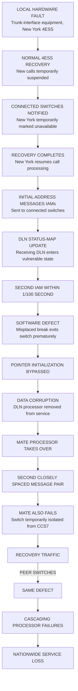

On January 15, 1990, a minor hardware fault in a New York AT&T 4ESS switch triggered a routine recovery sequence. The switch recovered as designed. The problem was what happened next: recovery traffic exposed a software defect present across AT&T's 114-switch fleet, causing neighboring signaling processors to fail and the failures to propagate through the national network.

For nine hours, the United States' premier telecommunications network descended into a cascading cycle of processor failures, reinitializations, and recovery traffic. The event left millions of people without long-distance service and established a new, urgent discipline: studying how highly connected, homogeneous systems behave when fault-recovery mechanisms inadvertently act as contagion vectors.

## What Was the 4ESS and CCS7 Network?

In 1990, the backbone of AT&T's long-distance infrastructure was the **4ESS (Number 4 Electronic Switching System)**. Each 4ESS was a massive, highly reliable telephone exchange designed to route thousands of calls per second.

The switches communicated with one another over a separate data network using **Common Channel Signaling System No. 7 (CCS7)**, an ITU-standardized signaling architecture. Instead of setting up a call by sending signals over the voice lines themselves (in-band signaling), the switches exchanged digital messages over the CCS7 network (out-of-band signaling). This allowed the network to route calls much faster, query databases for 800-number routing, and immediately tell a distant switch if a line was busy without dedicating a voice channel.

The critical component handling this signaling interface on the 4ESS was the **Direct Link Node (DLN)**, a processor responsible for maintaining status information associated with the CCS7 signaling network.

## The Mid-December Software Update

For several weeks, the updated software operated without the triggering sequence occurring in the field. The update was intended to improve network performance by allowing switches to access the backup signaling network more quickly when the primary CCS7 signaling network encountered problems.

Because AT&T maintained strict standardization across its infrastructure, the same vulnerable software update had been introduced across all 114 4ESS switches.

## The Incident Sequence

The failure began with a localized, completely normal fault in Manhattan.

### 1. The Trigger
At approximately 2:25 p.m. EST, trunk-interface equipment in a New York 4ESS developed an internal hardware problem. The switch entered its normal fault-recovery procedure, temporarily stopped accepting new calls, and notified connected switches.

### 2. The Return to Service
When the New York switch recovered and returned to service, it resumed call processing and sent **Initial Address Messages (IAMs)** to its connected switches to set up calls. 

### 3. The Vulnerability Window
A connected switch's DLN begins updating its status map after receiving the first IAM from the recovering New York switch; a second IAM arriving within 1/100 second triggers the defect.

### 4. The Data Corruption
The software defect caused the receiving DLN to skip a critical pointer initialization. The processor's data became corrupted, and error-recovery logic detected the inconsistency and shut the switch down.

### 5. The Cascade
When the affected switch went down, it sent its own recovery-related signaling to its connected peers. When this switch subsequently returned to service, its own resumed call traffic exposed the exact same defect in *its* neighbors, taking them down. The failure propagated through the national network.

## The Reconstructed C Defect

[RECONSTRUCTED] The published reconstruction of the defective C structure shows that the misplaced break bypassed the pointer-initialization path. Subsequent processing therefore operated with an uninitialized pointer, producing the data corruption that AT&T's contemporary account describes.

The defect was located in a `switch` statement containing a nested `if` block. 

```c
// [RECONSTRUCTED] Simplified representation of the control-flow defect
switch (message_type) {
    case IAM_MESSAGE:
        if (dln_status == UPDATING_MAP) {
            // Programmer intended to exit the 'if' block.
            // But in C, 'break' exits the enclosing 'switch' or 'loop'.
            break; 
        }
        
        // Critical pointer initialization skipped if 'break' executes
        optional_params_ptr = initialize_params(message);
        
        // ...
        
    case OTHER_MESSAGE:
        // ...
}

// Subsequent code uses the pointer, which is now uninitialized 
// if the 'break' path was taken.
process_optional_parameters(optional_params_ptr);
```

In C, the `break` statement exits the innermost enclosing `switch`, `while`, `do`, or `for` statement. It does *not* exit an `if` block. The programmer likely intended to bypass a specific block of logic and proceed to the pointer initialization, but instead exited the entire `switch` construct.

When the processor later attempted to process the optional parameters using the uninitialized pointer, the processor's data became corrupted. The DLN's self-checking mechanisms detected the corruption, removed the DLN from service, and attempted to hand over control to a mate processor. Because the incoming traffic pressure remained constant, the mate processor immediately encountered the same closely spaced IAMs, suffered the same defect, and the entire switch isolated itself from the signaling network to recover.



## The Fallout and Remediation

For nine hours, the network writhed in a state of continuous, rolling failure.

AT&T later reported that 148 million calls were handled that day, but only 83 million were completed, resulting in a 56% completion rate. Contemporary estimates placed the lost revenue at roughly $60–75 million. The Los Angeles Times reported that American Airlines' incoming 800-number call volume fell by two-thirds, though its Sabre reservation system used separate phone lines and remained operational. Marriott Hotels received only about 10% of its normal call volume.

### The Three-Stage Remediation

1. **Stabilize:** AT&T stabilized the network by temporarily suspending signaling traffic on its backup links, reducing the message load reaching affected DLN processors. Full service was restored by 11:30 p.m. EST.
2. **Contain:** The following day, AT&T removed the faulty program update and temporarily switched back to the previous program version.
3. **Correct:** Engineers reproduced the problem in the laboratory, corrected the flaw, tested the change, and then restored the backup signaling links.

## Systems Prevention Playbook

The production failure exposed a gap in recovery-path testing: laboratory testing had not reproduced the particular sequence of recovery, status-map update, closely spaced IAMs, and repeated peer failures.

### 1. Bounded Recovery Authority
Recovery mechanisms should have bounded authority. A peer's recovery event should not be able to trigger an unlimited sequence of local recovery actions across the network. Rate limiting, hysteresis, retry budgets, and escalation thresholds can prevent automated recovery from becoming a feedback amplifier.

### 2. Static Analysis and Tooling
Modern compilers, linters, and static-analysis tools can detect many forms of suspicious control flow and potentially uninitialized state. Stronger compiler diagnostics and structured control-flow review would reduce the likelihood of this class of defect escaping review.

### 3. Diversity vs. Homogeneity
The AT&T incident demonstrated the danger of monocultures. The same vulnerable software update was running on every node. Redundant hardware cannot protect against a common software defect replicated across the fleet when recovery traffic can repeatedly trigger the same defect on additional nodes.

## Then vs Now: Engineering Evolution

| Failure Dimension | The 1990 Failure | Modern Engineering Practice |
| :--- | :--- | :--- |
| **Deployment** | Update pushed to all 114 switches simultaneously | Canary deployments, phased rollouts, and blast-radius containment |
| **Recovery Signaling** | Peer recovery directly triggered local state vulnerability | Bounded event propagation, rate limiting, circuit breakers, retry budgets, and explicit recovery-state machines |
| **Failure Isolation** | Fault-recovery mechanism acted as propagation vector | Strict decoupling of control plane state from data plane processing |
| **Verification** | C control-flow ambiguity undetected in code review | Automated static analysis, linters (e.g., `-Wuninitialized`, `-Wimplicit-fallthrough`) |

## What the Evidence Establishes
> **[DOCUMENTED]**
> - The initial trigger was a trunk-interface hardware problem in New York.
> - The vulnerable software had been introduced in a mid-December update intended to improve backup signaling access.
> - The failure required two closely spaced IAMs within 1/100 of a second arriving while a receiving DLN was updating its status map.
> - Call completion rates fell to 56% (83M completed out of 148M handled).
> - AT&T stabilized the network by temporarily suspending signaling traffic on its backup links.

## What the Evidence Does NOT Establish
> **[UNKNOWN BOUNDARIES]**
> - The exact internal variable names, memory addresses, processor instructions, and complete production source code remain undisclosed in the public primary sources.
> - There is no evidence of a cyberattack, malicious intent, or external intrusion.

> **The Archivist's Assessment:**
> The failure was not simply a bad `break` statement. The `break` created the local defect; deployment of the same vulnerable recovery software across the 4ESS fleet created the common-mode condition; automated recovery created the repeated trigger; and CCS7 signaling provided the propagation path. 
> 
> The original hardware fault was routine. The catastrophe emerged because the system's recovery path had become coupled to the same software defect on neighboring nodes. A mechanism designed to restore service therefore became a mechanism for repeatedly creating new failures.
> 
> That is the enduring lesson of the 1990 AT&T collapse: reliability cannot be evaluated only by asking whether components survive failures. A resilient system must also be tested for what happens when components recover, announce that recovery, and re-enter a network whose other components are simultaneously changing state.

---
## Sources & Technical References
- AT&T Technical Disclosure via Peter G. Neumann, *RISKS Digest* (Vol. 9, Issues 62/63), 1990.
- *The Los Angeles Times*, "Software Glitch in AT&T System Set Off Network Collapse," January 17, 1990.
- *TIME Magazine*, "Ghost in the Machine," January 29, 1990.
- Peter van der Linden, *Expert C Programming: Deep C Secrets*, Prentice Hall, 1994.
- Bruce Sterling, *The Hacker Crackdown: Law and Disorder on the Electronic Frontier*, Bantam Books, 1992.
