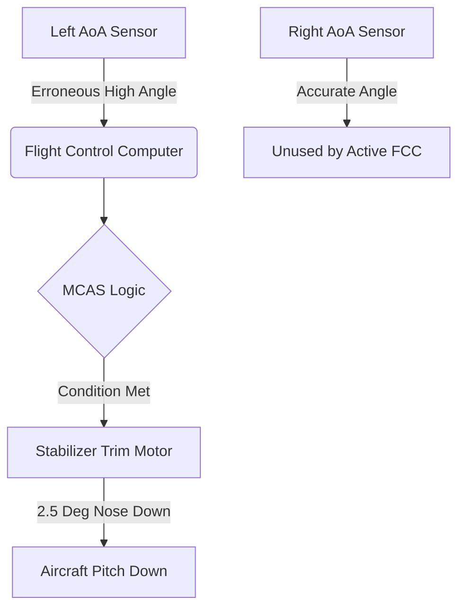

## Executive Summary

The Boeing 737 MAX crashes represent a watershed failure in cyber-physical systems engineering. Between October 2018 and March 2019, two 737 MAX 8 aircraft crashed, resulting in 346 fatalities. The official investigations revealed that an automated flight control law—the Maneuvering Characteristics Augmentation System (MCAS)—repeatedly commanded nose-down stabilizer trim based on erroneous data from a single Angle of Attack (AoA) sensor.

## The Forensic Discrepancy Matrix

| Parameter | Digital Representation | Physical Reality | Evidence Status | Mechanism |
| --- | --- | --- | --- | --- |
| AoA Sensor | High AoA condition | Aircraft not experiencing corresponding AoA | [DOCUMENTED] | Erroneous sensor input |
| MCAS Activation | Valid high-AoA trigger | Uncommanded nose-down trim | [DOCUMENTED] | Single-sensor-dependent control logic |
| MCAS Repetition | New valid activation after pilot trim | Repeated nose-down stabilizer inputs | [DOCUMENTED] | MCAS reset/retrigger logic |
| Cockpit Alerts | Multiple valid indications | Multiple symptoms of one underlying AoA fault | [DOCUMENTED] | Shared failure propagated across systems |

## What Was MCAS?

The Maneuvering Characteristics Augmentation System (MCAS) was a software function embedded within the 737 MAX flight control computers. Because the 737 MAX featured larger engines mounted further forward and higher on the wings than previous models, the aircraft exhibited a slight pitch-up tendency at elevated angles of attack. MCAS formed part of Boeing's broader effort to preserve handling characteristics and 737 commonality while accommodating the aerodynamic effects of the MAX's larger engines. That commonality objective was closely connected to the aircraft's certification and training strategy. The engineering failure occurred when that commonality objective interacted with an automation architecture whose failure assumptions were insufficiently conservative.

## Act I: The Anomaly and Quantitative Throughput

Flight data recorders from both Lion Air Flight 610 and Ethiopian Airlines Flight 302 demonstrate that immediately after takeoff, a single AoA sensor recorded a drastic spike in pitch angle. In the Lion Air case, the left AoA sensor recorded an angle approximately 20 degrees higher than the right sensor ([NTSB ASR-19-01](https://www.ntsb.gov/investigations/AccidentReports/Reports/ASR1901.pdf)). 

Because the active flight control computer was programmed to read from only one AoA sensor per flight, the software accepted the erroneous 20-degree differential as ground truth. This triggered MCAS, which provided automatic stabilizer trim. The MCAS design was substantially expanded during development, ultimately allowing a single activation to command up to approximately 2.5° of airplane nose-down stabilizer movement, while the system could repeatedly reactivate after pilot electric-trim inputs when the erroneous high-AoA condition persisted.

## Act II: Architecture and Reconstruction Diagram

The architecture of MCAS violated a fundamental tenet of safety-critical systems. The important architectural distinction is that the aircraft did not lack redundant AoA sensing; rather, the original MCAS implementation did not adequately use that available redundancy to protect the control law from an erroneous single-sensor input.

### Node-Level Provenance Diagram

## Act III: Fracture Sequence and Telemetry Log

The flight data recorders captured a fatal oscillation between automated commands and human counter-actions. MCAS was programmed to reset and fire again after a 5-second delay if the perceived high AoA persisted.

### Telemetry Timeline Table (Lion Air Flight 610)
| Time | Digital Representation | Physical Reality | Mechanism |
| --- | --- | --- | --- |
| 06:22:39 | Left AoA spikes 20° higher than Right | Sensor outputs faulty raw voltage | Erroneous AoA sensor output |
| 06:22:54 | MCAS Active | Aircraft artificially pitched down | Software commands 2.5° nose-down trim |
| 06:23:04 | Pilot trims nose up | Pilots fight control yoke | Electric manual trim interrupts MCAS |
| 06:23:09 | 5-second timeout expires | Left AoA still registers high | MCAS fires again, commanding another 2.5° down |

## Act IV: Financial and Legal Reckoning

The global grounding of the 737 MAX fleet lasted 20 months, inflicting unprecedented financial and reputational damage.

| Dimension | Impact |
| --- | --- |
| **Human Cost** | 346 fatalities across two flights. |
| **Financial Cost** | Multi-billion-dollar impact including compensation, aircraft grounding, production disruption, and related costs; estimates vary by methodology. |
| **Regulatory Action** | FAA mandated sweeping software and hardware architecture changes before ungrounding. |

## Why Testing Missed It: Simulation and Hazard Assessment

During development, Boeing's safety assessment assumed that an unintended stabilizer input would be readily recognizable, that pilots would immediately counter the increased control forces, and that the runaway-stabilizer procedure would be followed when appropriate. 

However, the simulator validation did not reproduce the erroneous-AoA failure that caused the MCAS activation in the accidents, and therefore did not reproduce the resulting combination of stick shaker, airspeed-disagree, altitude-disagree, and other cockpit indications. ([NTSB](https://www.ntsb.gov/investigations/AccidentReports/Reports/ASR1901.pdf)) Furthermore, the final version of MCAS had its trim authority increased from 0.6 degrees to 2.5 degrees, an operational envelope change that was not fully re-evaluated in the final hazard assessments.

## Corrected Architecture

To recertify the aircraft, the FAA and global regulators mandated fundamental architectural changes that removed the single point of failure.

| Feature | Original MCAS | Corrected architecture |
|---|---|---|
| **AoA processing** | One AoA signal used by MCAS at a time | Both AoA inputs monitored |
| **Disagreement detection** | No effective MCAS AoA disagreement protection | >5.5° disagreement for specified duration disables MCAS |
| **AoA selection** | No equivalent cross-check before MCAS activation | Middle-value-select logic incorporated |
| **Activation** | Repeated activations possible | Activation logic constrained |
| **Authority** | Approximately 2.5° maximum stabilizer command | Reduced/constrained authority |
| **Pilot awareness** | Limited system-specific awareness | Revised procedures, alerting and training |

## Systems Prevention Playbook

The MCAS failure provides critical lessons for any engineering team building cyber-physical or automated systems.

1. **Friction Defenses:** Ensure humans have adequate alerting when automation takes control. If a system is manipulating a physical state, the human operator must know *why*.
2. **Boundary Constraints:** Hard-code absolute limits. Software should never be granted enough authority to place the system in an unrecoverable state (e.g., maximum allowable trim angles).
3. **Emergency Brakes:** Implement hardware interlocks. When sensors disagree, the system must degrade safely rather than acting on unverified inputs.

## Engineering Evolution

| Historical Pattern | Modern Defensive Pattern |
| --- | --- |
| Single-sensor trust | Multi-sensor quorum and disagreement logic |
| Unlimited automated authority | Bounded actuation envelopes |
| Obscured automation logic | Transparent telemetry and mandatory operator alerting |

## The Archivist's Verdict

> **What the evidence establishes:**
> The original MCAS control logic could base an activation on a single AoA sensor input rather than requiring agreement between the aircraft's two independent AoA sensors. An erroneous AoA input could therefore trigger MCAS without the control law first establishing that the two available sensors agreed. The software then repeatedly pitched the aircraft down with increased 2.5-degree trim authority.
> 
> **What the evidence does NOT establish:**
> That the pilots were fundamentally incapable of flying the aircraft. The human operators were overwhelmed by an un-simulated cascade of conflicting alerts and aerodynamic forces they were not trained to expect.

> **The Archivist's Assessment:** The tragedy of the 737 MAX was not merely a software bug; it was the consequence of prioritizing commercial constraints (avoiding simulator training) over architectural safety. By attempting to use software to mask physical aerodynamic properties, the engineers introduced an unconstrained automation loop. When the hardware failed, the software dutifully executed its logic, dragging the aircraft down while blinding the human operators to the true state of the system.

## Frequently Asked Questions

### Why did Boeing create MCAS?
MCAS was created to counter the pitch-up tendency of the 737 MAX's new, larger engines at high angles of attack. The goal was to make the MAX handle exactly like older 737s, thereby avoiding the need for airlines to pay for expensive new simulator training for their pilots.

### Did the pilots know about MCAS?
Initial 737 MAX pilot training and normal flight-crew documentation did not adequately explain MCAS or prepare crews to recognize it as the source of the stabilizer behavior. After the Lion Air accident, Boeing provided additional information to operators before the Ethiopian Airlines crash. However, the crews were not trained to diagnose the underlying MCAS failure sequence in the way it unfolded during the accidents.

### How did a single sensor cause the crash?
The flight control software was designed to take input from only one Angle of Attack sensor per flight. When that single sensor fed erroneous data, the software had no mechanism to cross-check it against the other sensor.

### Why didn't the pilots just turn it off?
The crews were simultaneously confronted with multiple alerts and abnormal flight indications, increasing workload and complicating recognition of the underlying stabilizer-trim problem. The crews did attempt corrective actions, including using manual electric trim, but MCAS could reactivate after pilot trim inputs while the triggering AoA condition remained.

### What is the "runaway stabilizer" checklist?
It is a standard emergency procedure where pilots cut power to the stabilizer trim motor. Boeing's safety assessment assumed pilots would recognize the failure and execute this checklist, but simulator validation did not reproduce the complex combination of alerts and indications that pilots actually experienced during the failure.

### Was the software fixed?
Yes. The FAA mandated that the corrected software must read both sensors, disable MCAS if they disagree, limit MCAS to a single activation per event, and never grant MCAS more authority than the pilot's control column.

## Primary Sources
- [NTSB Safety Recommendation Report ASR-19-01](https://www.ntsb.gov/investigations/AccidentReports/Reports/ASR1901.pdf)
- [House Transportation and Infrastructure Committee Final Report on 737 MAX](https://transportation.house.gov/imo/media/doc/2020.09.15%20FINAL%20737%20MAX%20Report%20for%20Public%20Release.pdf)
