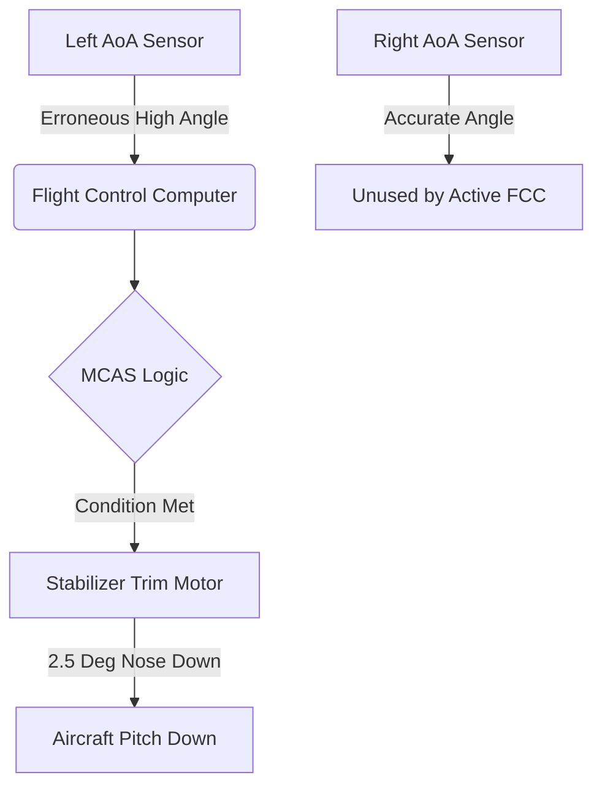

## Executive Summary

The Boeing 737 MAX crashes represent a watershed failure in cyber-physical systems engineering. Between October 2018 and March 2019, two 737 MAX 8 aircraft crashed, resulting in 346 fatalities. The official investigations revealed that an automated flight control law—the Maneuvering Characteristics Augmentation System (MCAS)—repeatedly commanded nose-down stabilizer trim based on erroneous data from a single Angle of Attack (AoA) sensor.

## The Forensic Discrepancy Matrix

| Parameter | Digital Representation | Physical Reality | Evidence Status | Mechanism |
| --- | --- | --- | --- | --- |
| AoA Sensor | Erroneous High Angle | Aircraft in Normal Pitch | [DOCUMENTED] | Hardware Defect |
| MCAS Activation | Legitimate Safety Intervention | Unnecessary Trim Down | [RECONSTRUCTED] | Software Design |
| Cockpit Alarms | Multiple Conflicting Alerts | Single Sensor Failure | [DOCUMENTED] | Notification Overload |

## What Was MCAS?

The Maneuvering Characteristics Augmentation System (MCAS) was a software function embedded within the 737 MAX flight control computers. Because the 737 MAX featured larger engines mounted further forward and higher on the wings than previous models, the aircraft exhibited a slight pitch-up tendency at elevated angles of attack. MCAS was designed to automatically trim the stabilizer nose-down to make the MAX feel aerodynamically identical to the older 737 Next Generation (NG), thereby avoiding the need for expensive new pilot simulator training.

## Act I: The Anomaly and Quantitative Throughput

Flight data recorders from both Lion Air Flight 610 and Ethiopian Airlines Flight 302 demonstrate that immediately after takeoff, a single AoA sensor recorded a drastic spike in pitch angle. In the Lion Air case, the left AoA sensor recorded an angle approximately 20 degrees higher than the right sensor ([NTSB ASR-19-01](https://www.ntsb.gov/investigations/AccidentReports/Reports/ASR1901.pdf)). 

Because the active flight control computer was programmed to read from only one AoA sensor per flight, the software accepted the erroneous 20-degree differential as ground truth. This triggered MCAS, which commanded a 2.5-degree nose-down stabilizer trim increment for 10 seconds.

## Act II: Architecture and Reconstruction Diagram

The architecture of MCAS violated a fundamental tenet of safety-critical systems: a system with catastrophic failure potential relied on a single point of data entry without redundancy or disagreement logic.

### Node-Level Provenance Diagram

## Act III: Fracture Sequence and Telemetry Log

The flight data recorders captured a fatal oscillation between automated commands and human counter-actions. MCAS was programmed to reset and fire again after a 5-second delay if the perceived high AoA persisted.

### Telemetry Timeline Table (Lion Air Flight 610)
| Time | Digital Representation | Physical Reality | Mechanism |
| --- | --- | --- | --- |
| 06:22:39 | Left AoA spikes 20° higher than Right | Sensor outputs faulty raw voltage | Hardware defect / Calibration failure |
| 06:22:54 | MCAS Active | Aircraft artificially pitched down | Software commands 2.5° nose-down trim |
| 06:23:04 | Pilot trims nose up | Pilots fight control yoke | Electric manual trim interrupts MCAS |
| 06:23:09 | 5-second timeout expires | Left AoA still registers high | MCAS fires again, commanding another 2.5° down |

## Act IV: Financial and Legal Reckoning

The global grounding of the 737 MAX fleet lasted 20 months, inflicting unprecedented financial and reputational damage.

| Dimension | Impact |
| --- | --- |
| **Human Cost** | 346 fatalities across two flights. |
| **Financial Cost** | Estimated over $20 billion in direct costs, fines, and compensation. |
| **Regulatory Action** | FAA mandated sweeping software and hardware architecture changes before ungrounding. |

## Why Testing Missed It: Simulation and Hazard Assessment

During development, Boeing's hazard assessment for an uncommanded MCAS activation assumed that pilots would recognize the failure and execute the runaway stabilizer checklist within 3 seconds. 

However, this assumption was tested in a clean simulator environment. Real-world pilots were simultaneously bombarded with multiple cascading alarms (stick shaker, airspeed disagree, altitude disagree) caused by the single faulty sensor. The sensory overload meant pilots did not immediately identify the specific stabilizer trim failure. Furthermore, the final version of MCAS had its trim authority increased from 0.6 degrees to 2.5 degrees, an operational envelope change that was not fully re-evaluated in the final hazard assessments.

## Corrected Architecture

To recertify the aircraft, the FAA and global regulators mandated fundamental architectural changes that removed the single point of failure.

| Feature | Before (Original MCAS) | After (Corrected Architecture) |
|---|---|---|
| **Sensor Inputs** | Active FCC relied on 1 AoA sensor. | FCC compares inputs from both AoA sensors. |
| **Disagreement Logic** | None. | If sensors disagree by >5.5 degrees, MCAS is disabled. |
| **Trim Authority** | Could fire repeatedly, stacking trim. | Can only fire once per high-AoA event. |
| **Pilot Override** | MCAS could overpower pilot yoke pull. | Control column pull always overrides MCAS. |

## Systems Prevention Playbook

The MCAS failure provides critical lessons for any engineering team building cyber-physical or automated systems.

1. **Friction Defenses:** Ensure humans have adequate alerting when automation takes control. If a system is manipulating a physical state, the human operator must know *why*.
2. **Boundary Constraints:** Hard-code absolute limits. Software should never be granted enough authority to place the system in an unrecoverable state (e.g., maximum allowable trim angles).
3. **Emergency Brakes:** Implement hardware interlocks. When sensors disagree, the system must degrade safely rather than acting on unverified inputs.

## Engineering Evolution

| Historical Pattern | Modern Defensive Pattern |
| --- | --- |
| Single-sensor trust | Multi-sensor quorum and disagreement logic |
| Unlimited automated authority | Bounded actuation envelopes |
| Obscured automation logic | Transparent telemetry and mandatory operator alerting |

## The Archivist's Verdict

> **What the evidence establishes:**
> The MCAS software was explicitly designed to rely on a single Angle of Attack sensor per flight, eliminating hardware redundancy. The sensor failed, feeding an erroneous 20-degree differential, and the software repeatedly pitched the aircraft down with increased 2.5-degree trim authority.
> 
> **What the evidence does NOT establish:**
> That the pilots were fundamentally incapable of flying the aircraft. The human operators were overwhelmed by an un-simulated cascade of conflicting alerts and aerodynamic forces they were not trained to expect.

> **The Archivist's Assessment:** The tragedy of the 737 MAX was not merely a software bug; it was the consequence of prioritizing commercial constraints (avoiding simulator training) over architectural safety. By attempting to use software to mask physical aerodynamic properties, the engineers introduced an unconstrained automation loop. When the hardware failed, the software dutifully executed its logic, dragging the aircraft down while blinding the human operators to the true state of the system.

## Frequently Asked Questions

### Why did Boeing create MCAS?
MCAS was created to counter the pitch-up tendency of the 737 MAX's new, larger engines at high angles of attack. The goal was to make the MAX handle exactly like older 737s, thereby avoiding the need for airlines to pay for expensive new simulator training for their pilots.

### Did the pilots know about MCAS?
No. Because Boeing wanted the aircraft to seem identical to older models, MCAS was intentionally omitted from the flight crew operations manual and pilot training materials.

### How did a single sensor cause the crash?
The flight control software was designed to take input from only one Angle of Attack sensor per flight. When that single sensor fed erroneous data, the software had no mechanism to cross-check it against the other sensor.

### Why didn't the pilots just turn it off?
The pilots were overwhelmed by multiple conflicting alarms (stick shaker, speed disagree) caused by the same faulty sensor. By the time they attempted to manually trim the aircraft, the aerodynamic forces on the tail were too extreme to overcome manually.

### What is the "runaway stabilizer" checklist?
It is a standard emergency procedure where pilots cut power to the stabilizer trim motor. Boeing assumed pilots would use this within 3 seconds of an MCAS failure, but real-world sensory overload made immediate diagnosis nearly impossible.

### Was the software fixed?
Yes. The FAA mandated that the corrected software must read both sensors, disable MCAS if they disagree, limit MCAS to a single activation per event, and never grant MCAS more authority than the pilot's control column.

## Primary Sources
- [NTSB Safety Recommendation Report ASR-19-01](https://www.ntsb.gov/investigations/AccidentReports/Reports/ASR1901.pdf)
- [House Transportation and Infrastructure Committee Final Report on 737 MAX](https://transportation.house.gov/imo/media/doc/2020.09.15%20FINAL%20737%20MAX%20Report%20for%20Public%20Release.pdf)
