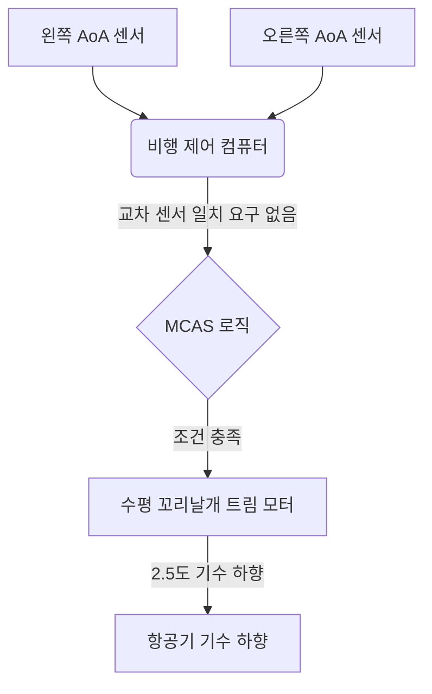

## 경영진 요약 (Executive Summary)

보잉 737 MAX 추락 사고는 사이버-물리 시스템 엔지니어링 분야의 분수령이 되는 실패 사례입니다. 2018년 10월부터 2019년 3월 사이 두 대의 737 MAX 8 항공기가 추락하여 346명이 사망했습니다. 공식 조사 결과에 따르면, 자동 비행 제어 법칙인 기동 특성 향상 시스템(MCAS)이 단일 받음각(AoA) 센서의 잘못된 데이터에 기반하여 반복적으로 기수 하향 수평 꼬리날개 트림(stabilizer trim)을 명령한 것으로 밝혀졌습니다.

## 포렌식 불일치 매트릭스 (The Forensic Discrepancy Matrix)

| 파라미터 | 디지털 표현 (Digital Representation) | 물리적 현실 (Physical Reality) | 증거 상태 | 메커니즘 |
| --- | --- | --- | --- | --- |
| AoA 센서 | 높은 AoA 조건 | 해당하는 AoA를 겪지 않는 항공기 | [DOCUMENTED] | 잘못된 센서 입력 |
| MCAS 작동 | 정당한 높은 AoA 트리거 | 명령되지 않은 기수 하향 트림 | [DOCUMENTED] | 단일 센서 의존 제어 로직 |
| MCAS 반복 | 조종사 트림 후 새로운 정당한 작동 | 반복적인 기수 하향 수평 꼬리날개 입력 | [DOCUMENTED] | MCAS 리셋/재트리거 로직 |
| 조종석 경보 | 여러 정당한 표시 | 하나의 근본적인 AoA 결함의 여러 증상 | [DOCUMENTED] | 여러 시스템으로 전파된 공유 고장 |

## MCAS란 무엇인가? (What Was MCAS?)

기동 특성 향상 시스템(MCAS)은 737 MAX 비행 제어 컴퓨터에 내장된 소프트웨어 기능이었습니다. 737 MAX는 이전 모델에 비해 날개의 더 높고 앞쪽에 장착된 대형 엔진을 특징으로 했기 때문에, 높은 받음각에서 약간 기수가 들리는(pitch-up) 경향을 보였습니다. MCAS는 MAX의 더 큰 엔진의 공기역학적 영향을 수용하면서 조종 특성과 737의 공통성을 유지하려는 보잉의 광범위한 노력의 일환이었습니다. 이러한 공통성 목표는 항공기의 인증 및 훈련 전략과 밀접하게 연관되어 있었습니다. 공통성 목표가 불충분하게 보수적인 고장 가정을 가진 자동화 아키텍처와 상호 작용했을 때 엔지니어링 실패가 발생했습니다.

## 1막: 이상 현상과 정량적 처리량 (Act I: The Anomaly and Quantitative Throughput)

라이온 에어 610편과 에티오피아 항공 302편의 비행 데이터 기록 장치(FDR)는 이륙 직후 단일 AoA 센서가 피치 각도에서 급격한 스파이크를 기록했음을 보여줍니다. 라이온 에어의 경우 왼쪽 AoA 센서가 오른쪽 센서보다 약 20도 높은 각도를 기록했습니다 ([NTSB ASR-19-01](https://www.ntsb.gov/investigations/AccidentReports/Reports/ASR1901.pdf)).

활성 비행 제어 컴퓨터는 비행당 단 하나의 AoA 센서에서만 데이터를 읽도록 프로그래밍되었기 때문에 소프트웨어는 20도의 잘못된 차이를 진실(ground truth)로 받아들였습니다. 이는 자동 수평 꼬리날개 트림을 제공하는 MCAS를 작동시켰습니다. MCAS 설계는 개발 중에 크게 확장되어 궁극적으로 단일 작동 시 최대 약 2.5°의 기수 하향 수평 꼬리날개 움직임을 명령할 수 있게 한 반면, 잘못된 높은 AoA 조건이 지속될 경우 조종사의 전동 트림 입력 후에도 시스템이 반복적으로 다시 활성화될 수 있었습니다.

## 2막: 아키텍처 및 재구성 다이어그램 (Act II: Architecture and Reconstruction Diagram)

원래의 MCAS 아키텍처는 잘못된 활성화에 대한 독립적인 검사로서 항공기의 사용 가능한 AoA 센서 이중화를 활용하지 못했습니다. 중요한 아키텍처상의 차이점은 항공기에 이중화된 AoA 센서가 부족했던 것이 아니라, 원래의 MCAS 구현이 잘못된 단일 센서 입력으로부터 제어 법칙을 보호하기 위해 그 사용 가능한 이중화를 적절히 활용하지 못했다는 것입니다.

### 노드 수준 프로비넌스 다이어그램 (Node-Level Provenance Diagram)

## 3막: 파손 순서 및 텔레메트리 로그 (Act III: Fracture Sequence and Telemetry Log)

비행 데이터 기록 장치는 자동화된 명령과 조종사의 대응 조치 사이의 치명적인 진동을 포착했습니다. 잘못된 높은 AoA 조건이 지속되는 동안 조종사의 전동 트림 입력 후에도 MCAS가 다시 활성화될 수 있었습니다.

### 재구성된 고장 순서 - 라이온 에어 610편 (Reconstructed Failure Sequence)
| 순서 | 기록/파생된 조건 | 시스템 반응 |
| --- | --- | --- |
| 1 | 왼쪽 AoA가 오른쪽과 크게 다름 | 잘못된 높은 AoA 조건 |
| 2 | MCAS 활성화 기준 충족 | 명령되지 않은 기수 하향 수평 꼬리날개 트림이 항공기 피치 반응을 변경함 |
| 3 | 조종사가 전동 트림 적용 | MCAS 활성화가 리셋됨 |
| 4 | 잘못된 높은 AoA 조건 지속 | MCAS가 다시 활성화될 수 있음 |

## 4막: 재정적 및 법적 평가 (Act IV: Financial and Legal Reckoning)

737 MAX 기단의 전 세계적인 운항 정지는 20개월 동안 지속되어 전례 없는 재정적, 평판적 피해를 입혔습니다.

| 차원 | 영향 |
| --- | --- |
| **인적 비용 (Human Cost)** | 두 번의 비행에 걸쳐 346명 사망. |
| **재정적 비용 (Financial Cost)** | 보상, 항공기 운항 정지, 생산 차질 및 관련 비용을 포함한 수십억 달러의 영향; 추정치는 방법론에 따라 다양함. |
| **규제 조치 (Regulatory Action)** | FAA는 운항 재개 전에 비행 제어 소프트웨어 업데이트, 조종석 디스플레이/경보 변경, 물리적 배선 분리 및 수정된 운영 절차/훈련을 의무화함. |

## 테스트가 왜 이를 놓쳤는가: 시뮬레이션 및 위험 평가 (Why Testing Missed It)

개발 중 보잉의 안전 평가에서는 의도하지 않은 수평 꼬리날개 입력이 쉽게 인식될 수 있고, 조종사가 증가된 조종력을 즉시 카운터할 것이며, 적절할 때 폭주 수평 꼬리날개 절차를 따를 것이라고 가정했습니다.

그러나 시뮬레이터 검증은 사고에서 MCAS 활성화를 일으킨 잘못된 AoA 고장을 재현하지 못했으며, 따라서 그 결과로 나타나는 스틱 셰이커, 대기속도 불일치, 고도 불일치 및 기타 조종석 표시의 조합을 재현하지 못했습니다. ([NTSB](https://www.ntsb.gov/investigations/AccidentReports/Reports/ASR1901.pdf)) MCAS 설계는 개발 중에 확장되어 수평 꼬리날개 명령 권한이 약 0.55도에서 2.5도로 증가했습니다. 후속 조사에 따르면 관련된 안전 평가는 반복적인 활성화로 인한 위험을 포함하여 결과적인 위험의 심각성을 적절히 설명하지 못한 것으로 나타났습니다.

## 수정된 아키텍처 (Corrected Architecture)

항공기를 재인증하기 위해 FAA 및 전 세계 규제 당국은 단일 장애점을 제거하는 근본적인 아키텍처 변경을 의무화했습니다.

| 기능 | 이전 (Original MCAS) | 수정된 아키텍처 (Corrected architecture) |
|---|---|---|
| **AoA 처리** | MCAS는 단일 AoA 입력에 따라 작동할 수 있었음 | MCAS는 양쪽 AoA 센서를 모두 사용하고 5.5° 초과 불일치 시 비활성화됨 |
| **활성화** | 반복 활성화 가능 | 높은 AoA 이벤트당 한 번의 활성화 |
| **권한** | 최대 약 2.5° 수평 꼬리날개 명령 | 조종간을 사용해 피치를 제어할 수 있는 조종사의 능력을 유지함 |
| **조종사 인식** | 시스템별 인식이 제한됨 | 수정된 절차, 경보 및 훈련 |

## 시스템 예방 플레이북 (Systems Prevention Playbook)

MCAS 실패는 사이버-물리 또는 자동화 시스템을 구축하는 모든 엔지니어링 팀에게 중요한 교훈을 제공합니다.

1. **마찰 방어 (Friction Defenses):** 자동화가 제어권을 가져갈 때 인간에게 충분한 경고가 주어지도록 보장하십시오. 시스템이 물리적 상태를 조작하고 있다면 인간 작업자는 그 *이유*를 반드시 알아야 합니다.
2. **경계 제약 (Boundary Constraints):** 절대적인 한계를 하드코딩하십시오. 소프트웨어는 결코 시스템을 복구 불가능한 상태로 만들 수 있는 충분한 권한(예: 최대 허용 트림 각도)을 부여받아서는 안 됩니다.
3. **비상 브레이크 (Emergency Brakes):** 하드웨어 인터록을 구현하십시오. 센서가 불일치할 때 시스템은 검증되지 않은 입력에 따라 작동하는 대신 안전하게 성능을 저하시켜야(degrade safely) 합니다.

## 엔지니어링 진화 (Engineering Evolution)

| 역사적 패턴 (Then) | 현대적 방어 패턴 (Now) |
| --- | --- |
| 단일 센서 신뢰 | 다중 센서 쿼럼 및 불일치 로직 |
| 무제한적인 자동화 권한 | 제한된 작동기 영역 (Bounded actuation envelopes) |
| 숨겨진 자동화 로직 | 투명한 텔레메트리 및 의무적인 작업자 경고 |

## 아키비스트의 판결 (The Archivist's Verdict)

> **증거가 입증하는 것:**
> 원래의 MCAS 제어 로직은 항공기의 두 독립적인 AoA 센서 간의 일치를 요구하는 대신 단일 AoA 센서 입력에 기반하여 작동할 수 있었습니다. 따라서 잘못된 AoA 입력은 제어 법칙이 사용 가능한 두 센서가 일치하는지 먼저 확인하지 않고도 MCAS를 트리거할 수 있었습니다. 소프트웨어는 이후 2.5도로 증가된 트림 권한을 사용하여 반복적으로 항공기의 기수를 하향시켰습니다.
> 
> **증거가 입증하지 않는 것:**
> 조종사들이 항공기를 조종할 근본적인 능력이 없었다는 것. 승무원들은 원래의 안전 평가 가정이 적절하게 대표하지 못한 동시 경보, 표시, 조종력 및 반복적인 수평 꼬리날개 입력의 복잡한 조합에 직면했습니다.

> **아키비스트의 분석:** 이 비극은 737 공통성을 둘러싼 상업적 및 인증 목표가 안전 가정이 부적절했던 자동화 아키텍처와 어떻게 상호 작용했는지 보여줍니다. 소프트웨어를 사용하여 물리적 공기역학 특성을 마스킹하려 시도함으로써 엔지니어들은 제약 없는 자동화 루프를 도입했습니다. 하드웨어가 실패했을 때 소프트웨어는 프로그래밍된 로직을 충실히 실행하여 항공기를 추락시키는 동시에 인간 조종사들을 시스템의 진정한 상태에 대해 눈멀게 했습니다.

## 자주 묻는 질문 (Frequently Asked Questions)

### 보잉은 왜 MCAS를 만들었나요?
MCAS는 737 MAX의 더 크고 새로운 엔진이 높은 받음각에서 기수를 들어 올리는 경향에 대응하기 위해 만들어졌습니다. 그 목표는 MAX가 구형 737 기종과 정확히 똑같이 조종되는 느낌을 주어 항공사들이 조종사들을 위한 값비싼 새로운 시뮬레이터 훈련 비용을 지불하지 않도록 하는 것이었습니다.

### 조종사들은 MCAS에 대해 알고 있었나요?
초기 737 MAX 조종사 훈련 및 정상적인 비행 승무원 문서는 MCAS를 적절히 설명하지 않았으며 승무원들이 이를 수평 꼬리날개 동작의 원인으로 인식하도록 준비시키지 못했습니다. 라이온 에어 사고 이후 보잉은 에티오피아 항공 추락 사고 전에 운영자들에게 추가 정보를 제공했습니다. 그러나 승무원들은 사고 당시 전개된 방식대로 근본적인 MCAS 고장 순서를 진단하도록 훈련받지 못했습니다.

### 어떻게 단 하나의 센서가 추락을 일으킬 수 있었나요?
비행 제어 소프트웨어는 비행당 단 하나의 받음각 센서에서만 입력을 받도록 설계되었습니다. 해당 단일 센서가 잘못된 데이터를 제공했을 때 소프트웨어는 이를 다른 센서와 교차 점검할 메커니즘이 없었습니다.

### 조종사들은 왜 단순히 시스템을 비활성화하지 않았나요?
승무원들은 다중 경보와 비정상적인 비행 표시에 동시에 직면하여 작업 부하가 증가하고 근본적인 수평 꼬리날개 트림 문제의 인식이 복잡해졌습니다. 승무원들은 수동 전동 트림을 사용하는 것을 포함하여 수정 조치를 시도했지만, 트리거링 AoA 조건이 남아있는 동안 조종사의 트림 입력 후에도 MCAS가 다시 활성화될 수 있었습니다.

### "폭주 수평 꼬리날개(runaway stabilizer)" 체크리스트란 무엇인가요?
조종사들이 수평 꼬리날개 트림 모터의 전원을 차단하는 표준 비상 절차입니다. 보잉의 안전 평가에서는 조종사들이 결함을 인식하고 이 체크리스트를 실행할 것이라고 가정했지만, 시뮬레이터 검증은 고장 당시 조종사들이 실제로 겪었던 복잡한 경보 및 표시 조합을 재현하지 못했습니다.

### 소프트웨어는 수정되었나요?
네. FAA는 수정된 소프트웨어가 두 센서를 모두 읽어야 하고, 두 센서가 불일치할 경우 MCAS를 비활성화하며, 기수 들림 현상당 단 한 번만 MCAS가 작동하도록 제한하고, 조종사의 조종간 입력보다 MCAS에 더 많은 권한을 주지 않도록 의무화했습니다.

## 공식 1차 출처
- [NTSB Safety Recommendation Report ASR-19-01](https://www.ntsb.gov/investigations/AccidentReports/Reports/ASR1901.pdf)
- [House Transportation and Infrastructure Committee Final Report on 737 MAX](https://transportation.house.gov/imo/media/doc/2020.09.15%20FINAL%20737%20MAX%20Report%20for%20Public%20Release.pdf)
- [FAA Summary of the Boeing 737 MAX Return to Service](https://www.faa.gov/sites/faa.gov/files/2022-08/737_RTS_Summary.pdf)
