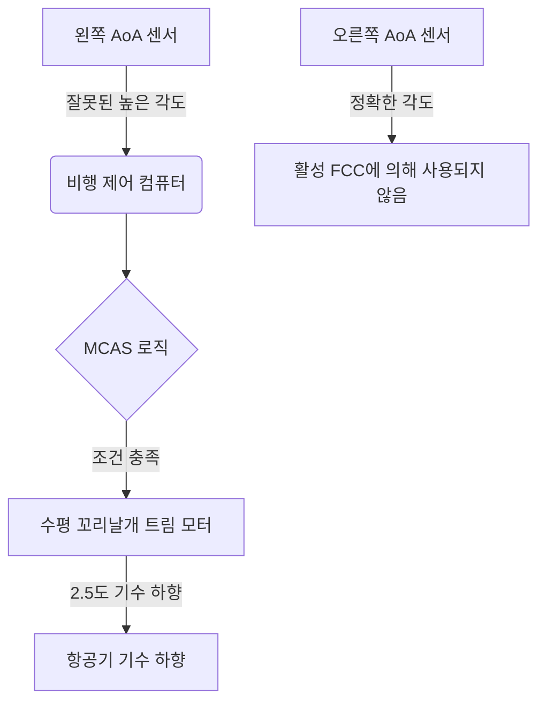

## 경영진 요약 (Executive Summary)

보잉 737 MAX 추락 사고는 사이버-물리 시스템 엔지니어링 분야의 분수령이 되는 실패 사례입니다. 2018년 10월부터 2019년 3월 사이 두 대의 737 MAX 8 항공기가 추락하여 346명이 사망했습니다. 공식 조사 결과에 따르면, 자동 비행 제어 법칙인 기동 특성 향상 시스템(MCAS)이 단일 받음각(AoA) 센서의 잘못된 데이터에 기반하여 반복적으로 기수 하향 수평 꼬리날개 트림(stabilizer trim)을 명령한 것으로 밝혀졌습니다.

## 포렌식 불일치 매트릭스 (The Forensic Discrepancy Matrix)

| 파라미터 | 디지털 표현 (Digital Representation) | 물리적 현실 (Physical Reality) | 증거 상태 | 메커니즘 |
| --- | --- | --- | --- | --- |
| AoA 센서 | 잘못된 높은 받음각 | 정상 피치의 항공기 | [DOCUMENTED] | 잘못된 AoA 센서 출력 |
| MCAS 작동 | 정당한 안전 개입 | 불필요한 기수 하향 | [RECONSTRUCTED] | 소프트웨어 설계 |
| 조종석 경보 | 여러 상충되는 알람 | 단일 센서 고장 | [DOCUMENTED] | 알림 과부하 |

## MCAS란 무엇인가? (What Was MCAS?)

기동 특성 향상 시스템(MCAS)은 737 MAX 비행 제어 컴퓨터에 내장된 소프트웨어 기능이었습니다. 737 MAX는 이전 모델에 비해 날개의 더 높고 앞쪽에 장착된 대형 엔진을 특징으로 했기 때문에, 높은 받음각에서 약간 기수가 들리는(pitch-up) 경향을 보였습니다. MCAS는 MAX의 더 큰 엔진의 공기역학적 영향을 수용하면서 조종 특성과 737의 공통성을 유지하려는 보잉의 광범위한 노력의 일환이었습니다. 이러한 공통성 목표는 항공기의 인증 및 훈련 전략과 밀접하게 연관되어 있었습니다. 공통성 목표가 불충분하게 보수적인 고장 가정을 가진 자동화 아키텍처와 상호 작용했을 때 엔지니어링 실패가 발생했습니다.

## 1막: 이상 현상과 정량적 처리량 (Act I: The Anomaly and Quantitative Throughput)

라이온 에어 610편과 에티오피아 항공 302편의 비행 데이터 기록 장치(FDR)는 이륙 직후 단일 AoA 센서가 피치 각도에서 급격한 스파이크를 기록했음을 보여줍니다. 라이온 에어의 경우 왼쪽 AoA 센서가 오른쪽 센서보다 약 20도 높은 각도를 기록했습니다 ([NTSB ASR-19-01](https://www.ntsb.gov/investigations/AccidentReports/Reports/ASR1901.pdf)).

활성 비행 제어 컴퓨터는 비행당 단 하나의 AoA 센서에서만 데이터를 읽도록 프로그래밍되었기 때문에 소프트웨어는 20도의 잘못된 차이를 진실(ground truth)로 받아들였습니다. 이는 자동 수평 꼬리날개 트림을 제공하는 MCAS를 작동시켰습니다. 조종사의 전동 트림 개입 후 트리거 조건이 남아 있으면 MCAS는 5초 후에 또 다른 기수 하향 입력을 명령할 수 있었습니다. 최종 MCAS 설계는 이전 개념보다 수평 꼬리날개 권한이 크게 확대되어 약 0.55°에서 2.5°로 증가했습니다.

## 2막: 아키텍처 및 재구성 다이어그램 (Act II: Architecture and Reconstruction Diagram)

MCAS 아키텍처는 MCAS 제어 로직 내에서 사용 가능한 AoA 센서 이중화를 사용하지 못함으로써 안전 중심 시스템의 기본 원칙을 위반했습니다. 항공기는 이중화된 센서를 갖추고 있었지만 안전에 필수적인 제어 기능이 해당 이중화를 적절히 활용하지 못했습니다.

### 노드 수준 프로비넌스 다이어그램 (Node-Level Provenance Diagram)

## 3막: 파손 순서 및 텔레메트리 로그 (Act III: Fracture Sequence and Telemetry Log)

비행 데이터 기록 장치는 자동화된 명령과 조종사의 대응 조치 사이의 치명적인 진동을 포착했습니다. MCAS는 인식된 높은 AoA가 지속될 경우 5초 지연 후 리셋되어 다시 작동하도록 프로그래밍되어 있었습니다.

### 텔레메트리 타임라인 테이블 - 라이온 에어 610편 (Telemetry Timeline Table)
| 시간 | 디지털 표현 | 물리적 현실 | 메커니즘 |
|---|---|---|---|
| 06:22:39 | 왼쪽 AoA가 오른쪽보다 20° 높게 스파이크 | 센서가 잘못된 원시 전압을 출력 | 잘못된 AoA 센서 출력 |
| 06:22:54 | MCAS 활성화 | 항공기가 인위적으로 기수 하향됨 | 소프트웨어가 2.5° 기수 하향 트림을 명령 |
| 06:23:04 | 조종사가 기수 상향 트림을 시도 | 조종사들이 조종간과 싸움 | 전동 수동 트림이 MCAS를 인터럽트 |
| 06:23:09 | 5초 타임아웃 만료 | 왼쪽 AoA가 여전히 높게 기록됨 | MCAS가 다시 작동하여 추가로 2.5° 하향 명령 |

## 4막: 재정적 및 법적 평가 (Act IV: Financial and Legal Reckoning)

737 MAX 기단의 전 세계적인 운항 정지는 20개월 동안 지속되어 전례 없는 재정적, 평판적 피해를 입혔습니다.

| 차원 | 영향 |
| --- | --- |
| **인적 비용 (Human Cost)** | 두 번의 비행에 걸쳐 346명 사망. |
| **재정적 비용 (Financial Cost)** | 운항 정지 및 후속 시정 조치로 수십억 달러의 재정적 영향이 발생했으며, 널리 보도된 추정치는 200억 달러를 초과함. |
| **규제 조치 (Regulatory Action)** | FAA는 운항 재개 전에 대대적인 소프트웨어 및 하드웨어 아키텍처 변경을 의무화함. |

## 테스트가 왜 이를 놓쳤는가: 시뮬레이션 및 위험 평가 (Why Testing Missed It)

개발 중 보잉의 예기치 않은 MCAS 작동에 대한 위험 평가에서는 조종사가 결함을 인식하고 3초 이내에 폭주 수평 꼬리날개(runaway stabilizer) 체크리스트를 실행할 것이라고 가정했습니다.

그러나 이 가정은 깨끗한 시뮬레이터 환경에서 테스트되었습니다. 실제 조종사들은 단일 결함 센서로 인해 발생하는 다중 연쇄 경보(스틱 셰이커, 대기속도 불일치, 고도 불일치)에 동시에 노출되었습니다. 감각의 과부하(sensory overload)로 인해 조종사들은 특정 수평 꼬리날개 트림 결함을 즉각적으로 식별하지 못했습니다. 더욱이 MCAS 최종 버전은 트림 권한이 0.6도에서 2.5도로 증가했는데, 이는 최종 위험 평가에서 완전히 재평가되지 않은 운영 영역(operational envelope)의 변경이었습니다.

## 수정된 아키텍처 (Corrected Architecture)

항공기를 재인증하기 위해 FAA 및 전 세계 규제 당국은 단일 장애점을 제거하는 근본적인 아키텍처 변경을 의무화했습니다.

| 기능 | 이전 (Original MCAS) | 수정된 아키텍처 (Corrected architecture) |
|---|---|---|
| **AoA 처리** | 한 번에 하나의 AoA 신호만 MCAS에서 사용됨 | 양쪽 AoA 입력 모두 모니터링됨 |
| **불일치 감지** | 효과적인 MCAS AoA 불일치 보호 장치 없음 | 지정된 시간 동안 5.5° 이상 불일치 시 MCAS 비활성화됨 |
| **AoA 선택** | MCAS 활성화 전 동등한 교차 점검 없음 | 중간값 선택(Middle-value-select) 로직 통합됨 |
| **활성화** | 반복 활성화 가능 | 활성화 로직이 제한됨 |
| **권한** | 최대 약 2.5° 수평 꼬리날개 명령 | 권한 축소/제한됨 |
| **조종사 인식** | 시스템별 인식이 제한됨 | 수정된 절차, 경보 및 훈련 |

## 시스템 예방 플레이북 (Systems Prevention Playbook)

MCAS 실패는 사이버-물리 또는 자동화 시스템을 구축하는 모든 엔지니어링 팀에게 중요한 교훈을 제공합니다.

1. **마찰 방어 (Friction Defenses):** 자동화가 제어권을 가져갈 때 인간에게 충분한 경고가 주어지도록 보장하십시오. 시스템이 물리적 상태를 조작하고 있다면 인간 작업자는 그 *이유*를 반드시 알아야 합니다.
2. **경계 제약 (Boundary Constraints):** 절대적인 한계를 하드코딩하십시오. 소프트웨어는 결코 시스템을 복구 불가능한 상태로 만들 수 있는 충분한 권한(예: 최대 허용 트림 각도)을 부여받아서는 안 됩니다.
3. **비상 브레이크 (Emergency Brakes):** 하드웨어 인터록을 구현하십시오. 센서가 불일치할 때 시스템은 검증되지 않은 입력에 따라 작동하는 대신 안전하게 성능을 저하시켜야(degrade safely) 합니다.

## 엔지니어링 진화 (Engineering Evolution)

| 역사적 패턴 (Then) | 현대적 방어 패턴 (Now) |
| --- | --- |
| 단일 센서 신뢰 | 다중 센서 쿼럼 및 불일치 로직 |
| 무제한적인 자동화 권한 | 제한된 작동기 영역 (Bounded actuation envelopes) |
| 숨겨진 자동화 로직 | 투명한 텔레메트리 및 의무적인 작업자 경고 |

## 아키비스트의 판결 (The Archivist's Verdict)

> **증거가 입증하는 것:**
> 원래의 MCAS 제어 로직은 항공기의 두 독립적인 AoA 센서 간의 일치를 요구하는 대신 단일 AoA 센서 입력에 기반하여 작동할 수 있었습니다. 따라서 잘못된 AoA 입력은 제어 법칙이 사용 가능한 두 센서가 일치하는지 먼저 확인하지 않고도 MCAS를 트리거할 수 있었습니다. 소프트웨어는 이후 2.5도로 증가된 트림 권한을 사용하여 반복적으로 항공기의 기수를 하향시켰습니다.
> 
> **증거가 입증하지 않는 것:**
> 조종사들이 항공기를 조종할 근본적인 능력이 없었다는 것. 인간 작업자들은 시뮬레이션되지 않은 연쇄적인 상충 경보와 예상하지 못한 공기역학적 힘에 의해 압도당했습니다.

> **아키비스트의 분석:** 737 MAX의 비극은 단순한 소프트웨어 버그가 아니었습니다. 아키텍처 안전성보다 상업적 제약(시뮬레이터 훈련 회피)을 우선시한 필연적 결과였습니다. 소프트웨어를 사용하여 물리적 공기역학 특성을 마스킹하려 시도함으로써 엔지니어들은 제약 없는 자동화 루프를 도입했습니다. 하드웨어가 실패했을 때 소프트웨어는 프로그래밍된 로직을 충실히 실행하여 항공기를 추락시키는 동시에 인간 조종사들을 시스템의 진정한 상태에 대해 눈멀게 했습니다.

## 자주 묻는 질문 (Frequently Asked Questions)

### 보잉은 왜 MCAS를 만들었나요?
MCAS는 737 MAX의 더 크고 새로운 엔진이 높은 받음각에서 기수를 들어 올리는 경향에 대응하기 위해 만들어졌습니다. 그 목표는 MAX가 구형 737 기종과 정확히 똑같이 조종되는 느낌을 주어 항공사들이 조종사들을 위한 값비싼 새로운 시뮬레이터 훈련 비용을 지불하지 않도록 하는 것이었습니다.

### 조종사들은 MCAS에 대해 알고 있었나요?
초기에 조종사들은 정상적인 737 MAX 비행 승무원 문서 및 훈련의 일부로서 MCAS에 대해 적절히 알지 못했습니다. 라이온 에어 사고 이후 보잉은 에티오피아 항공 추락 사고 전에 운영자들에게 추가 정보를 발행했습니다. 그러나 승무원들은 고장 순서에 관련된 근본적인 자동화 시스템으로서 MCAS를 인식하도록 훈련받지 못했습니다.

### 어떻게 단 하나의 센서가 추락을 일으킬 수 있었나요?
비행 제어 소프트웨어는 비행당 단 하나의 받음각 센서에서만 입력을 받도록 설계되었습니다. 해당 단일 센서가 잘못된 데이터를 제공했을 때 소프트웨어는 이를 다른 센서와 교차 점검할 메커니즘이 없었습니다.

### 조종사들은 왜 그것을 끄지 않았나요?
승무원들은 수동 전동 트림을 사용하는 것을 포함하여 수정 조치를 시도했습니다. 그러나 트리거링 AoA 조건이 남아있는 동안 조종사의 트림 입력 후에도 MCAS가 다시 활성화될 수 있었으며, 승무원들은 동시에 다중 경보 및 비정상적인 비행 표시에 대처하고 있었습니다. NTSB는 조종사가 고장을 얼마나 빨리 인식하고 대응할지에 대한 인증 가정이 실제 조종석 환경을 적절히 고려하지 못했다고 결론지었습니다.

### "폭주 수평 꼬리날개(runaway stabilizer)" 체크리스트란 무엇인가요?
조종사들이 수평 꼬리날개 트림 모터의 전원을 차단하는 표준 비상 절차입니다. 보잉은 조종사들이 MCAS 오작동 후 3초 이내에 이를 사용할 것이라고 가정했지만, 실제 세계에서의 감각적 과부하는 즉각적인 진단을 거의 불가능하게 만들었습니다.

### 소프트웨어는 수정되었나요?
네. FAA는 수정된 소프트웨어가 두 센서를 모두 읽어야 하고, 두 센서가 불일치할 경우 MCAS를 비활성화하며, 기수 들림 현상당 단 한 번만 MCAS가 작동하도록 제한하고, 조종사의 조종간 입력보다 MCAS에 더 많은 권한을 주지 않도록 의무화했습니다.

## 공식 1차 출처
- [NTSB Safety Recommendation Report ASR-19-01](https://www.ntsb.gov/investigations/AccidentReports/Reports/ASR1901.pdf)
- [House Transportation and Infrastructure Committee Final Report on 737 MAX](https://transportation.house.gov/imo/media/doc/2020.09.15%20FINAL%20737%20MAX%20Report%20for%20Public%20Release.pdf)
